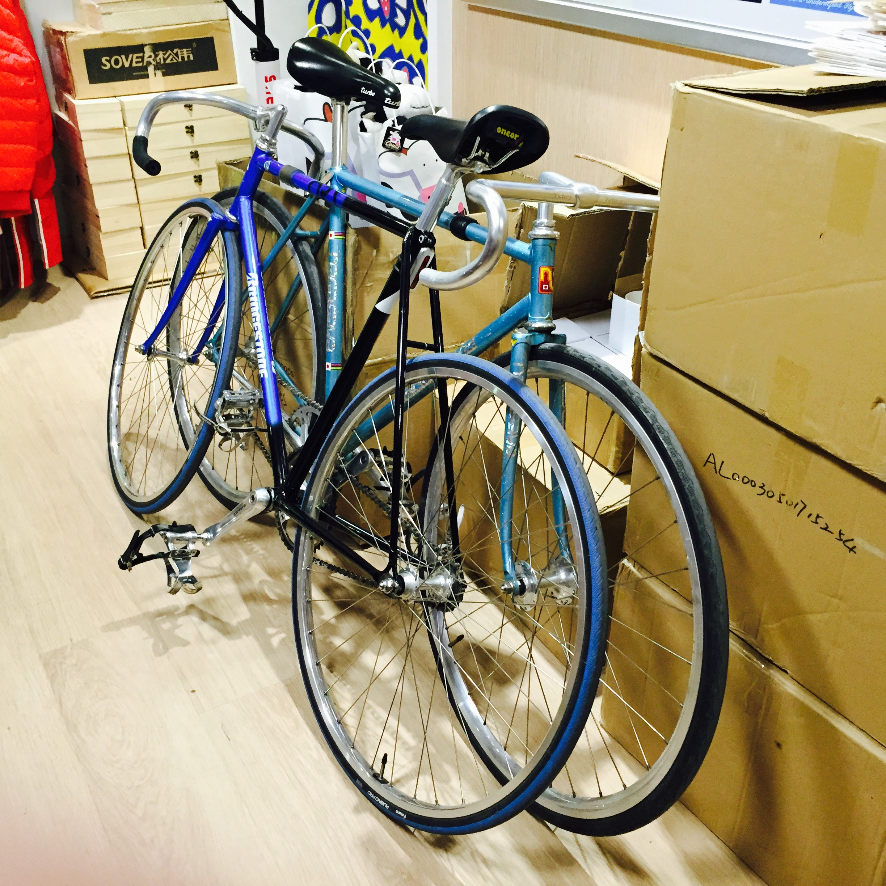
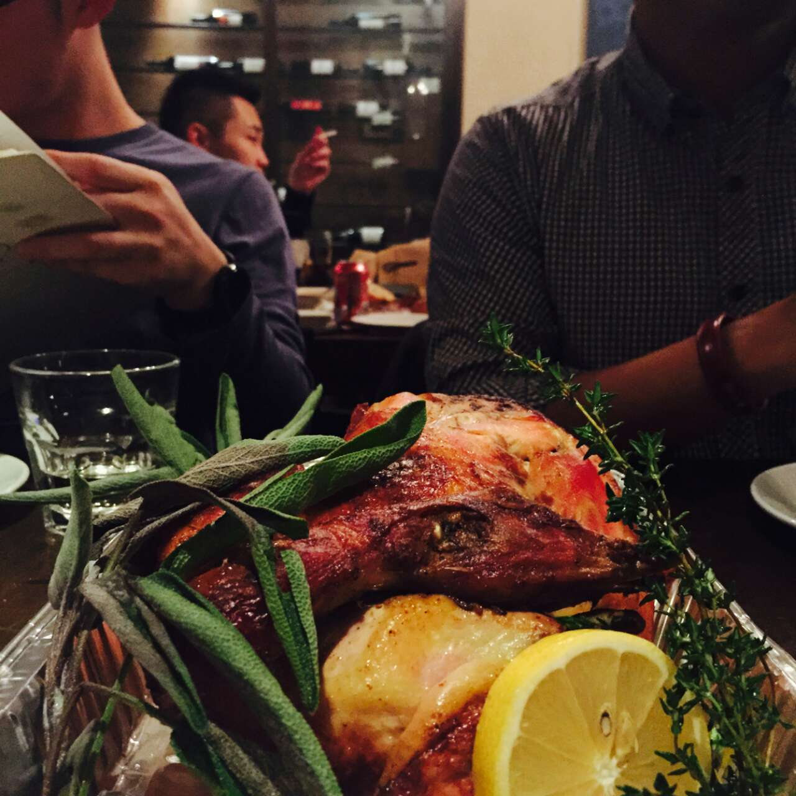
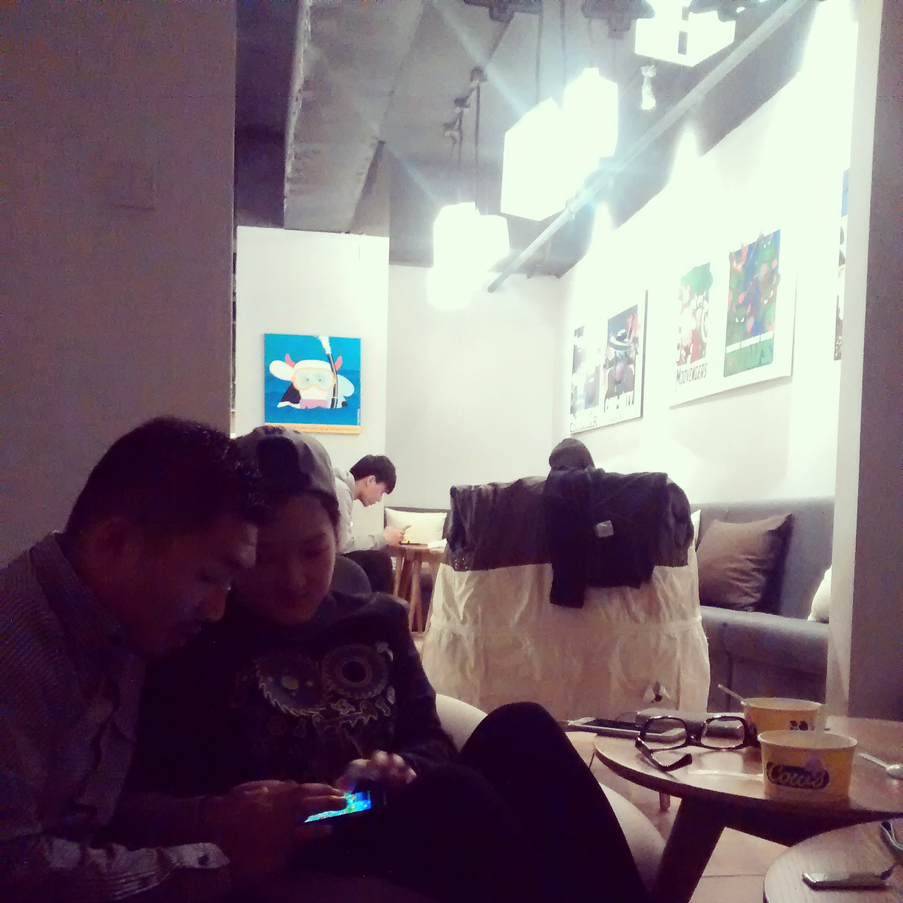



#写一篇有关Christmas的日记

test

这天是几位朋友的生日心中默默祝福他们生日快乐~

这天原本依旧是骑车-上班-下班-骑车的生活~

这天在下班前收到小伙伴们临时组局的消息~

这天下班后朋友几人在原本就该朋友聚会的日子里分食了烤鸡~
（交换品尝了面食）

这天晚饭后在Cows二层的阁楼中，舀食着冰淇淋，慢嘬着热可可~

话题不断的聊了几个小时，调侃，生活，趣闻，电影，音乐，台湾腔, 或许还有将来~

这天在聊天的几个小时里，几人坐卧在懒人沙发中，微醺了~

这天店家的热情一同温暖着寒风中骑行的rider们~

可以放车的拐角，文雅的店员~

Share抓拍我们搬车照片的老板~

这天我忘记了放在冰箱的午间便当~

当再次启程骑车奔回家中;

洗漱，整理，准备继续未完成的工作时;

随手开启一瓶可乐;

圣诞定制的Logo;

~在这几个瞬间，忽闪过的画面

~感觉到温馨的生活气息

~美好却又平常的一天

~已经踱步到25日

~Well it`s Christmas time

循环着 Kiss Me Babe,it`s Christmas time - OWL CITY

图片：

餐厅：Jazz·ya（爵士吧）

甜点：Cows梦工厂

文字上传:豆瓣/Gitpages Blog

如果能找到我Git Blog也可以看比较多东西。。
